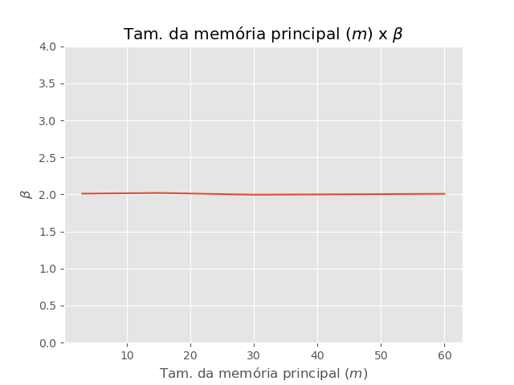
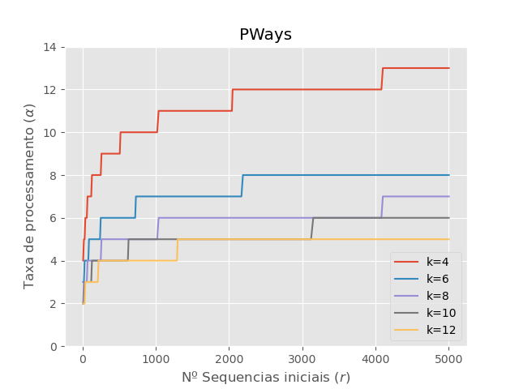
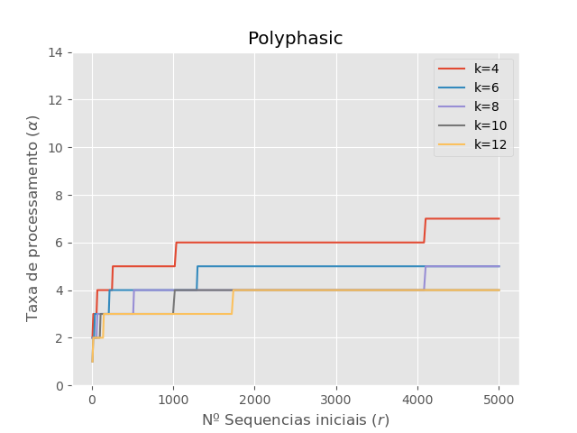
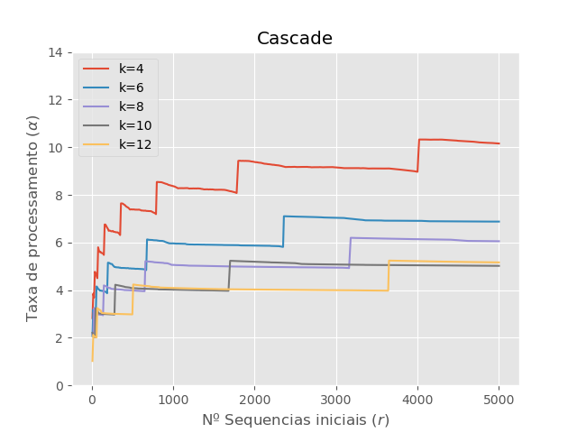

# External Sorting

## Description
This repository contains the implementation of three different sorting algorithms, used to sort values contained in secondary memory. This work was made by David Lima, Israel Pedreira and Márcio dos Santos for the Data Structures and Algorithms II course, lectured by Prof. George Lima at the Federal University of Bahia (UFBa) in the first semester of 2024.

## Usage
```bash
python3 main.py
```

## Algorithms
 - Balanced P-Ways Merge Sort
 - Polyphasic Merge Sort
 - Cascade Merge Sort

## Results
### Heap

 
### Algorithms



